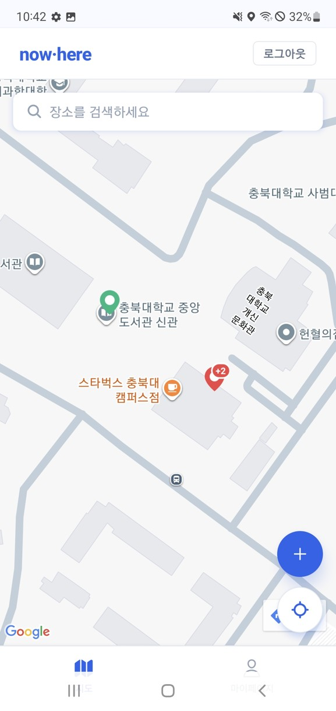
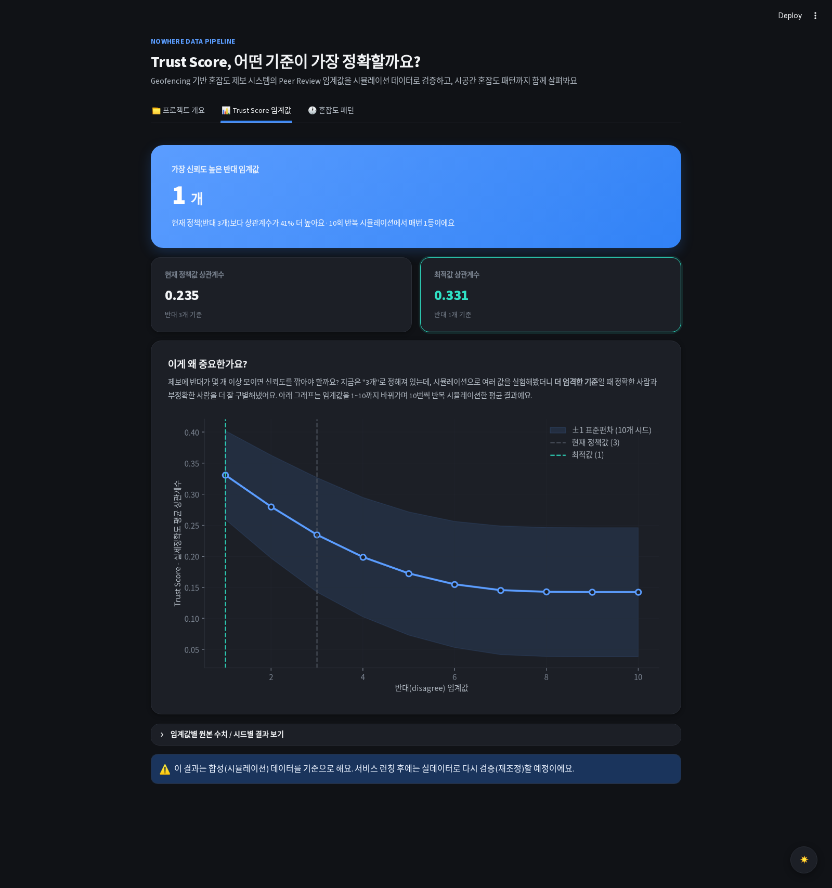
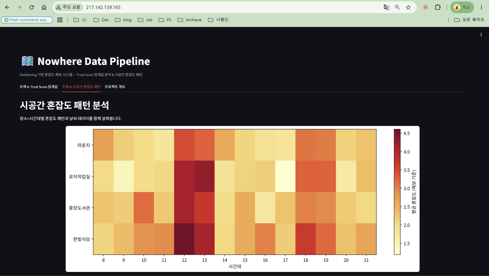
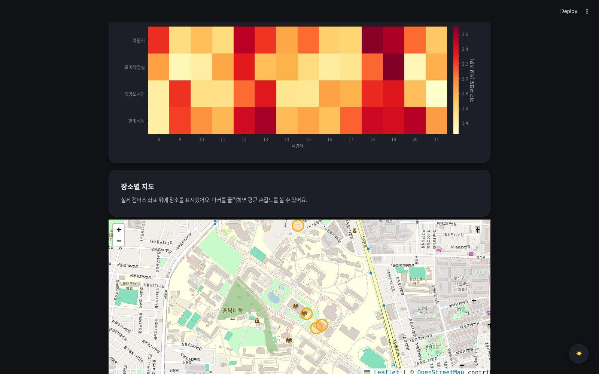
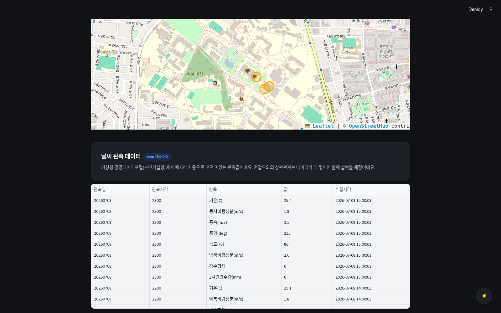

# Nowhere Data Pipeline

> **누구나 제보할 수 있는 실시간 혼잡도 앱, 거짓 제보는 어떻게 걸러낼까요?**

Nowhere는 사용자들이 서로의 제보를 검증하는 방식(Peer Review)으로 신뢰도를 관리합니다. 이 파이프라인은 그 검증 기준이 실제로 잘 작동하는지 데이터로 확인한 결과이며, CBNU "Cloud 기반 데이터AI 파이프라인구축" 과목 최종 평가 과제로 제작되었습니다.

**배포 URL**: http://217.142.139.165 · **Notion 문서**: https://app.notion.com/p/3984a969a1c78112b7e9f70995118766

---

## 왜 이 파이프라인이 필요한가요?

Nowhere는 근처의 다른 사용자들이 제보를 검증하는 **Peer Review** 방식을 쓰고, 검증 결과에 따라 제보자의 신뢰도 점수(Trust Score)를 조정합니다.

이 점수는 단순한 배지가 아닙니다. **신뢰도 점수가 높은 유저의 제보가 지도에 더 강하게 반영되는 가중치 알고리즘**을 도입할 계획이라, Trust Score는 "한 사람의 제보가 얼마나 영향력을 가질지"를 결정하는 핵심 값입니다.

그런데 "반대 개수가 몇 개 모이면 신뢰도를 깎아야 하는지" 같은 구체적인 기준은, 서비스가 아직 런칭 전이라 실제 데이터로 검증된 적이 없었습니다. 이 파이프라인은 그 공백을 시뮬레이션 데이터로 미리 채웁니다.

### 두 가지 트랙으로 검증합니다

- **트랙 A — Trust Score 임계값 분석**: 반대 개수 기준을 1~10까지 바꿔가며, 어떤 값이 정확한 제보자와 부정확한 제보자를 가장 잘 구별하는지 검증
- **트랙 B — 시공간 혼잡도 패턴 분석**: 장소×시간대별 혼잡도 패턴을 분석하고, 기상청 공공데이터(날씨)를 결합하여 향후 B2G(학교 행정실 대상) 리포트 제공 기반 마련

---

## Nowhere 앱 실제 데모 화면

| 혼잡도 지도 | 장소 상세 | Peer Review |
|:---:|:---:|:---:|
|  |  |  |
| 캠퍼스 내 거점별 혼잡도가 지도에 실시간 표시됩니다 | 장소를 탭하면 현재 혼잡 상태와 동의 수, 최근 제보 이력을 확인합니다 | 근처 사용자가 제보를 검증(동의/비동의)하여 Trust Score에 반영합니다 |

## 실행 화면

**트랙 A — Trust Score 임계값 분석**


반대 개수 임계값 1일 때 평균 상관계수 0.331로 가장 높게 나타났으며, 임계값이 커질수록 상관계수가 단조 감소하는 경향을 보입니다.

**트랙 B — 시공간 혼잡도 패턴 분석**


점심시간(12-13시), 저녁시간(18-19시) 피크가 뚜렷하게 관찰되며, 한빛식당(학식)의 혼잡도가 전반적으로 높게 나타납니다.

**장소별 지도** (실제 캠퍼스 좌표 기반, folium)


**날씨 관측 데이터** (기상청 공공데이터, cron 매시간 자동 수집)


---

## 아키텍처

```
[수집]                     [저장]                    [가공]                   [제공]

시뮬레이션 데이터 생성      PostgreSQL 16 + PostGIS    트랙 A: 임계값별          Streamlit 대시보드
(가상 User/Report/Vote)    (crowd_pipeline DB)         Trust Score 상관분석     (차트 + 히트맵 + 지도)
        +                  Block Volume                      +                        +
기상청 공공데이터 API        (로컬 CSV/로그)             트랙 B: PostGIS           nginx 리버스 프록시
(초단기실황, cron 매시간)   Object Storage               공간쿼리 + 날씨 결합      (80 → 8501)
                           (원본 데이터/결과 백업)
```

**사용 OCI 리소스**

| 리소스 | 사양 | 역할 |
|---|---|---|
| Compute VM (vm-03) | Oracle Linux 8, 2 OCPU/16GB | PostgreSQL, Streamlit, cron, nginx 전부 구동 |
| Block Volume | 로컬 블록 스토리지 | DB 데이터 디렉토리, 스크립트·로그 저장 |
| Object Storage | nowhere-pipeline-data 버킷 | 원본 데이터·분석 결과 백업 |
| VCN / Security List | 인바운드 규칙 | PostgreSQL(5432), 웹(80) 포트만 허용 |

전체 워크플로우 다이어그램:


---

## 설치 및 실행 방법

### 사전 요구사항
- OCI VM Instance (Oracle Linux 8 이상)
- conda 환경 (Python 3.11)
- PostgreSQL 16 + PostGIS 3.3 (`scripts/setup_postgis.md` 참고)
- 기상청 공공데이터포털(data.go.kr) API 인증키
- 한글 폰트: `sudo dnf install -y google-noto-sans-cjk-ttc-fonts`

### 설치 및 실행

```bash
# 1. 패키지 설치
conda activate bigdata
pip install -r requirements.txt --break-system-packages

# 2. 환경변수 설정 (.env.example 참고)
export CROWD_APP_PW="<DB 비밀번호>"
export WEATHER_API_KEY="<기상청 API 인증키>"
export ANTHROPIC_API_KEY="<Anthropic API 키>"  # Q&A 챗봇용

# 3. DB 스키마 적용
psql -h localhost -U crowd_app -d crowd_pipeline -f scripts/schema.sql

# 4. 시뮬레이션 데이터 생성
python scripts/generate_simulation_data.py

# 5. 날씨 데이터 수집 (cron 자동화 권장)
python scripts/fetch_weather.py

# 6. 대시보드 실행
streamlit run app/dashboard.py --server.port 8501
```

### cron 자동화 (날씨 데이터 매시간 수집)
```bash
0 * * * * cd /home/opc/data-pipeline && /home/opc/miniconda3/envs/bigdata/bin/python scripts/fetch_weather.py >> logs/weather.log 2>&1
```

---

## 데이터 흐름

| 단계 | 소스 | 처리 | 목적지 |
|---|---|---|---|
| 수집 | ① 시뮬레이션 생성 (가상 User/Report/Vote)<br>② 기상청 공공데이터 API | 확률분포 기반 생성 (성실 85% / 어뷰징 15%), REST API 호출 | PostgreSQL, Object Storage |
| 저장 | 시뮬레이션 데이터, 날씨 관측값 | GIST 공간 인덱스, 시계열 누적 | PostgreSQL + PostGIS |
| 가공 | Trust Score 계산 (트랙 A), 시공간 집계 (트랙 B) | 임계값별 상관분석, ST_DWithin 기반 geofence 집계 | 분석 결과 테이블 |
| 제공 | 분석 결과 | Streamlit 시각화 | nginx 경유 웹 서비스 |

**실제 캠퍼스 장소** (백엔드 `DataInitializer.java` 기준 실좌표):

| 이름 | 카테고리 | Geofence 반경 |
|---|---|---|
| 한빛식당 | SCHOOL | 100m |
| 중앙도서관 | SCHOOL | 100m |
| 라운지 | CAFE | 80m |
| 로이작업실 | CAFE | 80m |

---

## Trust Score 시뮬레이션 설계

> ⚠️ 이 파이프라인은 팀이 검토 중인 **확장 설계**를 기준으로 시뮬레이션합니다. 현재 배포된 백엔드 코드(`TrustScoreScheduler.java`)와 파라미터가 다를 수 있습니다.

| 항목 | 이 파이프라인 (확장 설계) | 현재 배포 코드 |
|---|---|---|
| 기본 점수 | 50 (0~100 범위) | 0 |
| 동의(agree) | +1점 | 미반영 |
| 반대(disagree) | 3개까지 무사, 초과분마다 -1 | 3개 이상이면 flat -1 |
| 반영 시점 | 제보 만료 후 배치 처리 | 동일 |

---

## 이식성 — Docker Compose 설계

향후 실사용자 환경 이전을 대비해 컨테이너화 설계를 마련했습니다. (설계 수준, `docker compose up` 검증 미수행)

| 서비스 | 이미지 | 역할 |
|---|---|---|
| `postgres` | `postgis/postgis:16-3.3` | DB (호스트 5432와 충돌 방지 위해 5433 매핑) |
| `streamlit` | `app/Dockerfile` | 대시보드 |
| `cron` | `scripts/Dockerfile.cron` | 날씨 API 매시간 자동 수집 |
| `nginx` | `nginx:1.25-alpine` | 80 → streamlit 리버스 프록시 |

---

## 한계점 및 향후 개선 방향

- **합성 데이터 기반**: 런칭 후 동일 파이프라인에 실데이터를 흘려보내 재조정(recalibration) 예정
- **혼잡도 표현 단순화**: 실제 서비스는 LOW/MEDIUM/HIGH 3단계이나, 분석 편의상 순서형 점수로 근사
- **가중치 알고리즘 미구현**: "고신뢰 유저 제보에 더 큰 영향력" 알고리즘은 이번 범위를 벗어나 근거 제시까지만 다룸
- **공간별 차등 임계값**: 현재는 전역 단일 임계값 검증. 향후 장소 카테고리별 차등 적용 방안 검토 예정
- **크로스클라우드 설계**: 실서비스(AWS) - 파이프라인(OCI) 분리 시, 주기적 스냅샷 기반 분석 구조로 전환 예정

---

## 프로젝트 구조

```
data-pipeline/
├── README.md
├── requirements.txt
├── docker-compose.yml          # 컨테이너화 설계 초안
├── .env.example
├── scripts/
│   ├── setup_postgis.md        # PostgreSQL+PostGIS 설치 가이드
│   ├── schema.sql               # DB 스키마 (vm-03 실배포 기준)
│   ├── generate_simulation_data.py
│   ├── fetch_weather.py         # 기상청 API 연동
│   ├── upload_to_object_storage.py
│   └── Dockerfile.cron
├── analysis/
│   ├── track_a_threshold.py    # 트랙 A: 임계값 분석
│   └── track_b_spatiotemporal.py  # 트랙 B: 시공간 패턴 분석
├── app/
│   ├── dashboard.py             # Streamlit 대시보드
│   └── Dockerfile
├── nginx/nginx.conf
└── docs/
    ├── workflow_diagram.png
    ├── nowhere_report.docx      # 평가 기준 순서에 맞춘 보고서
    └── screenshots/
```

---

## 관련 저장소

- [backend](https://github.com/CBNU-SWCapstone-B5-TJTS-now/backend) — Nowhere 서비스 백엔드 (Spring Boot)
- [nowhere-docs](https://github.com/CBNU-SWCapstone-B5-TJTS-now/nowhere-docs) — 프로젝트 문서/기능명세서

*작성: 김태화 (2020039079) · 충북대학교 소프트웨어학과 · Cloud 기반 데이터AI 파이프라인구축 · 2026*
