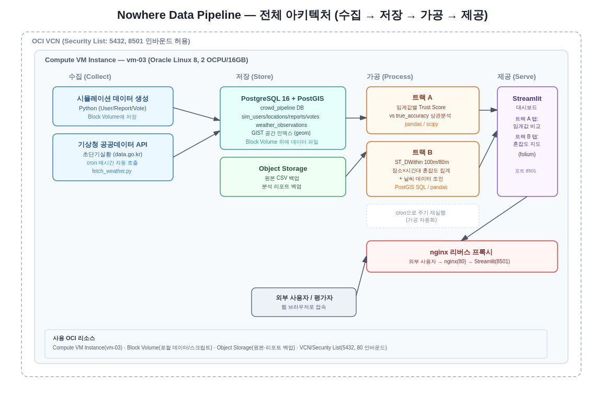

# Nowhere Data Pipeline

Geofencing 기반 혼잡도 제보 앱 **Nowhere**(CBNU SW캡스톤 졸업 프로젝트, [nowhere-docs](https://github.com/CBNU-SWCapstone-B5-TJTS-now) 참고)의 Peer Review / Trust Score 기능을 대상으로 한 **OCI 기반 Cloud 데이터 파이프라인** 프로젝트입니다.

> "Cloud 기반 데이터AI 파이프라인구축" 과목 최종 평가 과제로 제작되었습니다.

## 1. 서비스 소개 및 사용 시나리오

Nowhere는 Geofence로 현장 인증된 유저들의 동의/반대 투표를 바탕으로 제보자의 **Trust Score**를 조정하는 Peer Review 시스템을 갖고 있습니다. 그러나 서비스가 아직 런칭 전이라 실사용자 데이터가 없고, Trust Score의 반대(disagree) 임계값(현재 설계: 3개 초과분마다 -1)이 실제로 합리적인 값인지 검증할 데이터가 없는 상태입니다.

이 파이프라인은 다음 두 가지 문제를 데이터로 검증합니다.

- **트랙 A — Trust Score 임계값 최적화**: 시뮬레이션 데이터로 여러 임계값을 실험하여, 어떤 값이 "실제로 정확한 제보자"와 "부정확한/어뷰징 제보자"를 가장 잘 구별하는지 검증
- **트랙 B — 시공간 혼잡도 패턴 분석**: 장소×시간대별 혼잡도 패턴을 분석하고, 기상청 공공데이터(날씨)를 결합하여 향후 B2G(학교 행정실 대상) 리포트 제공 기반을 마련

## 2. 아키텍처

```
[수집]                    [저장]                      [가공]                    [제공]

시뮬레이션 데이터 생성      PostgreSQL 16 + PostGIS      트랙 A: pandas 상관분석     Streamlit 대시보드
(Python, 가상 User/         (crowd_pipeline DB,          (임계값별 Trust Score       (임계값 비교 차트 +
 Report/Vote)                GIST 공간 인덱스)            vs 실제 정확도)              혼잡도 히트맵/지도)
        +                          +                            +                         +
기상청 공공데이터 API       Block Volume                 트랙 B: PostGIS 공간쿼리     nginx 리버스 프록시로
(초단기실황, data.go.kr)    (로컬 CSV/로그)               (장소×시간대 집계 +          외부 서비스 제공
        ↓                  Object Storage                날씨 상관관계)
   OCI vm-03에서             (원본 CSV, 리포트 백업)              +
   cron으로 매시간 자동                                    cron 스케줄러로 주기 실행
   수집·적재
```

**사용 OCI 리소스**
- Compute VM Instance (vm-03, Oracle Linux 8, 2 OCPU/16GB)
- Block Volume (로컬 파일시스템 — CSV, 로그, 스크립트)
- Object Storage (원본 데이터 및 리포트 백업)
- VCN / Security List (PostgreSQL 5432, Streamlit 서비스 포트 인바운드 허용)

전체 워크플로우 다이어그램:



## 3. 설치 및 실행 방법

### 사전 요구사항
- OCI VM Instance (Oracle Linux 8 이상)
- conda 환경 (Python 3.11)
- PostgreSQL 16 + PostGIS 3.3
- 공공데이터포털(data.go.kr) 기상청 API 인증키

### 설치

```bash
# 1. PostgreSQL 16 + PostGIS 설치는 scripts/setup_postgis.md 참고

# 2. conda 환경 및 패키지 설치
conda activate bigdata
pip install psycopg2-binary sqlalchemy geoalchemy2 folium streamlit streamlit-folium requests pandas numpy scipy --break-system-packages

# 3. 환경변수 설정
export CROWD_APP_PW="<DB 비밀번호>"
export WEATHER_API_KEY="<기상청 공공데이터 API 인증키>"

# 4. DB 스키마 적용
psql -h localhost -U crowd_app -d crowd_pipeline -f scripts/schema.sql

# 5. 시뮬레이션 데이터 생성 및 적재
python scripts/generate_simulation_data.py

# 6. 날씨 데이터 수집 (cron으로 매시간 자동 실행 등록 권장)
python scripts/fetch_weather.py

# 7. 대시보드 실행
streamlit run app/dashboard.py --server.port 8501
```

### cron 자동화 등록 예시
```bash
# 매시간 정각에 날씨 데이터 수집
0 * * * * cd /home/opc/nowhere-pipeline && /home/opc/miniconda3/envs/bigdata/bin/python fetch_weather.py >> logs/weather.log 2>&1
```

## 4. 데이터 흐름 상세 설명

| 단계 | 소스 | 처리 | 목적지 |
|---|---|---|---|
| 수집 | ① Python 시뮬레이션 (User/Report/Vote 합성 데이터)<br>② 기상청 공공데이터포털 초단기실황 API | 확률분포 기반 생성 (성실 유저 85% / 어뷰징성 15%), REST API 호출 | PostgreSQL, Object Storage(원본 백업) |
| 저장 | 시뮬레이션 데이터, 날씨 관측값 | GIST 공간 인덱스 적용 (`sim_locations.geom`), 시계열 누적(`weather_observations`) | PostgreSQL + PostGIS (`crowd_pipeline` DB) |
| 가공 | Trust Score 계산 (트랙 A), 시공간 집계 (트랙 B) | 임계값별 반복 계산 + 상관분석, `ST_DWithin` 기반 geofence 집계 | 분석 결과 테이블 (`threshold_results` 등) |
| 제공 | 분석 결과 | Streamlit 대시보드로 시각화 | nginx 리버스 프록시 경유 웹 서비스 |

**실제 캠퍼스 장소 데이터** (졸업 프로젝트 백엔드 `DataInitializer.java` 기준):

| 이름 | 카테고리 | Geofence 반경 |
|---|---|---|
| 한빛식당 | SCHOOL | 100m |
| 중앙도서관 | SCHOOL | 100m |
| 라운지 | CAFE | 80m |
| 로이작업실 | CAFE | 80m |

## 5. Trust Score 계산 로직

> ⚠️ 실제 백엔드(`backend` 레포)의 `TrustScoreScheduler.java`는 현재 "반대 3개 이상이면 flat -1"이라는 단순화된 버전만 구현되어 있습니다. 이 파이프라인은 팀이 확정한 **최종 설계**를 기준으로 시뮬레이션합니다.

- 기본 점수: 50 (범위 0~100, 클리핑)
- 동의(agree) 1개당 +1
- 반대(disagree) 3개까지는 무사, **초과분마다 -1씩 누적 감점**
- Trust Score는 제보 즉시가 아니라 **제보 만료 시점에 배치로 반영** (실제 스케줄러 구조와 동일한 철학)

## 6. 한계점 및 향후 개선 방향

- **합성 데이터 기반**: 서비스 런칭 전이라 실사용자 데이터가 없어 시뮬레이션으로 대체함. 런칭 후 동일 파이프라인을 실데이터로 재조정(recalibration) 예정
- **가중치 알고리즘 미구현**: "고신뢰 유저 제보에 더 큰 영향력을 부여"하는 가중 투표 알고리즘은 이번 과제 범위를 벗어나 시뮬레이션 근거 제시까지만 다룸
- **공간별 차등 임계점**: 현재는 전역 단일 임계값을 검증하나, 향후 장소 카테고리(SCHOOL/CAFE)별로 다른 임계값을 적용하는 방안 검토 예정 — 이미 geofence 반경이 카테고리별로 차등 적용된 것과 같은 맥락
- **날씨-혼잡도 상관관계**: 수집 기간이 짧아 통계적으로 유의미한 상관관계 분석에는 한계가 있으며, 장기 수집 시 더 신뢰도 높은 분석이 가능할 것으로 예상
- **네트워크 타임아웃**: 초기 테스트에서 `requests` 라이브러리로 기상청 API 호출 시 간헐적 타임아웃이 발생했으나(`curl`로는 정상 응답), 타임아웃을 30초로 늘려 해결. 원인은 명확히 특정되지 않았으며 향후 재현 시 추가 조사 필요

## 프로젝트 구조

```
data-pipeline/
├── README.md
├── scripts/
│   ├── setup_postgis.md              # PostgreSQL+PostGIS 설치 가이드
│   ├── schema.sql                     # DB 스키마
│   ├── generate_simulation_data.py
│   ├── fetch_weather.py               # 기상청 공공데이터 API 연동
│   └── upload_to_object_storage.py    # Object Storage 백업
├── analysis/
│   ├── track_a_threshold.py           # 트랙 A: 임계값 분석
│   └── track_b_spatiotemporal.py      # 트랙 B: 시공간 패턴 분석
├── app/
│   └── dashboard.py                    # Streamlit 대시보드
└── docs/
    └── workflow_diagram.png            # 전체 워크플로우 다이어그램
```

## 관련 저장소

- [backend](https://github.com/CBNU-SWCapstone-B5-TJTS-now/backend) — Nowhere 서비스 백엔드 (Spring Boot)
- [nowhere-docs](https://github.com/CBNU-SWCapstone-B5-TJTS-now/nowhere-docs) — 프로젝트 문서/기능명세서
